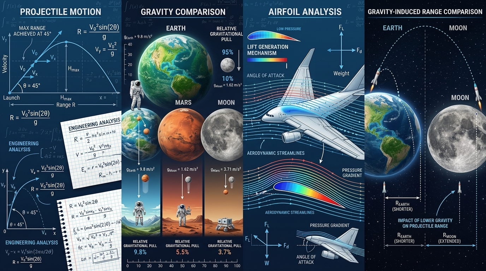

# Quantitative Thinking Series

Applied Mathematics • Statistics • Engineering Analysis • Scientific Modeling

A collection of quantitative reasoning, mathematics, statistics, engineering analysis, and scientific modeling projects that explore real-world scientific and engineering problems through data-driven thinking.

## Projects

### Quantitative Thinking #1
🔗 [Quantitative-Thinking-1](https://github.com/Azrailkimdir/Quantitative-Thinking-1)

Exploring why a 45° launch angle produces the maximum projectile range using mathematics, Excel-based analysis, and aerospace engineering principles.

### Quantitative Thinking #2
🔗 [Quantitative-Thinking-2](https://github.com/Azrailkimdir/Quantitative-Thinking-2)

Investigating how gravity influences weight on Earth, the Moon, and Mars through mathematical modeling, Excel analysis, and space science concepts.

### Quantitative Thinking #3
🔗 [Quantitative-Thinking-3](https://github.com/Azrailkimdir/Quantitative-Thinking-3)

Analyzing how airspeed affects lift generation using mathematics, Excel modeling, and aerospace engineering fundamentals.

### Quantitative Thinking #4
🔗 [Quantitative-Thinking-4](https://github.com/Azrailkimdir/Quantitative-Thinking-4)

Examining how gravitational differences between Earth and the Moon influence projectile motion and range through quantitative analysis and space science applications.
``

## Skills & Topics

- Quantitative Reasoning
- Applied Mathematics
- Statistics
- Engineering Analysis
- Aerospace Fundamentals
- Scientific Modeling
- Excel-Based Simulations
- Data Interpretation
- STEM Problem Solving

## Purpose

The Quantitative Thinking Series was created to strengthen analytical thinking skills by connecting mathematics and scientific principles with real-world engineering and aerospace applications.

---

### Author

**Sarp AKAR**

*Always Curious. Always Learning.*

